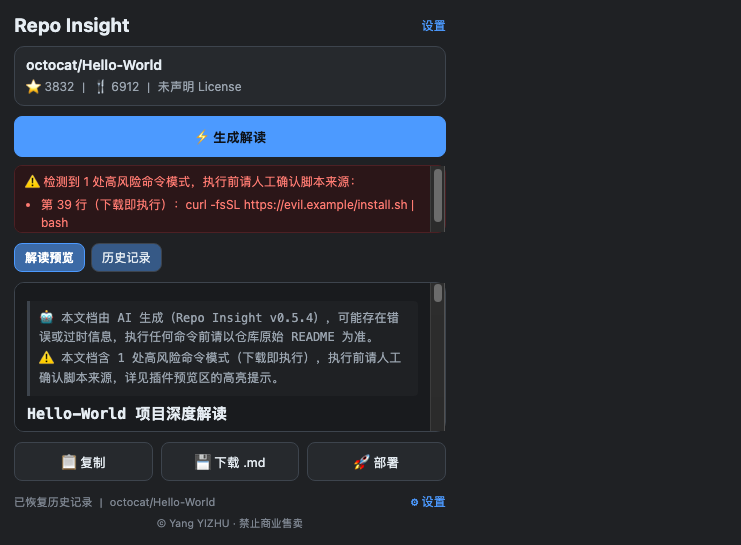

<div align="center">

# Repo Insight · Open Source Repo Analyzer

**One click on any GitHub repository page → a structured "project analysis + deployment plan" in Markdown**

Chrome / Edge extension (Manifest V3) · zero dependencies · local-first · light & dark themes

[](LICENSE)
[](#)
[](#file-layout)
[](NOTICE.md)

[中文说明](README.md)

</div>



---

## What it does

Evaluating an unfamiliar open-source project usually means reading a long README, guessing the stack, and figuring out how to run it. Repo Insight compresses that into one click:

1. Detects the GitHub repository of the current tab;
2. Fetches metadata, README, languages and the root file listing;
3. Generates a **fixed-structure Chinese analysis** (positioning / architecture / risks / audience / deployment workflow / rating);
4. Offers two deployment paths — **cloud sandbox** (Codespaces / Gitpod / StackBlitz) or **local deployment** with a rule-based risk assessment, a read-only environment check and a runnable script;
5. Exports Markdown you can copy, download or feed to coding agents as project context.

> The generated document itself is in Chinese (the extension targets Chinese-speaking developers), while the UI strings and this README are available in both languages.

## Highlights

- **Fixed output template** with a structure self-check — missing sections are flagged instead of silently shipped.
- **Streaming output** — first content appears in 1–3 seconds instead of waiting 10–30 seconds.
- **Rule-based risk assessment** (no LLM): pipe-to-shell, credential file access, PATH/startup modification, privilege escalation, disabled TLS checks, encoded payload execution, globally installed packages, hard-coded secrets, suspicious `.env` commits.
- **Deployment in two flavours**: sandbox links, or a generated `docker run --rm` deployment script with `--dry-run` / `--host` / `--clean`.
- **Privacy first**: private-repo confirmation before anything leaves the machine, local Ollama path where nothing leaves at all, secret masking across preview / copy / download / history / export.
- **Quota friendly**: ETag conditional requests + 6h cache — re-reading the same repo costs zero GitHub requests.
- **Zero dependencies**: no build step, no npm install, clone and load unpacked.
- **Minimal permissions**: `storage` + `activeTab` + explicit host list; custom gateways request permission at runtime.

## Install

1. Clone or download this repository to a permanent folder;
2. Open `chrome://extensions` (Edge: `edge://extensions`);
3. Enable **Developer mode**;
4. Click **Load unpacked** and select the folder containing `manifest.json`;
5. Pin **Repo Insight** to the toolbar.

Requirements: Chrome/Edge 110+, no build tools, no runtime dependencies.

## Configure a model (optional)

Without configuration the extension still works — it produces a basic analysis from a local rule-based template (repo info, stack detection, deployment skeleton).

Supported providers: DeepSeek, OpenAI, Zhipu GLM, Moonshot, Qwen, **local Ollama**, or any OpenAI-compatible endpoint (custom domains ask for permission at runtime).

For a GitHub token: when you only want a higher rate limit (60 → 5000 req/h), **no write scope is needed** — use a fine-grained token with *Public Repositories (read-only)*. Do not use `repo` or `public_repo`.

## Differences from similar tools

| Aspect | Typical tools | Repo Insight |
|---|---|---|
| Output | Free-form, different every time | Fixed template + structure self-check |
| Deployment | Textual advice only | Sandbox links **and** runnable deployment script (containerised by default) |
| Risk analysis | Usually none | Rule-based scan incl. hard-coded secrets and risky shell patterns |
| Environment check | Not possible | Read-only detection script → paste JSON → dependency table |
| Privacy | Everything goes to the cloud | Private-repo guard, local Ollama mode, full secret masking |
| Data retention | Unclear | History can be disabled/cleared/exported (never contains keys) |
| Quota usage | Refetch every time | ETag + cache, zero requests on repeat views |

## File layout

```
manifest.json · background.js · popup.* · options.* · deploy.* · privacy.html
theme.css · styles.css
lib/        13 dependency-free ES modules (github, llm, prompt, template, risk, deploy, security, history, markdown-view, settings, errors, url)
_locales/   zh_CN + en
icons/      16 / 48 / 128 px
docs/       documentation and screenshots
tools/      icon generation and packaging scripts
```

## License and attribution

**This project comes from Yang YIZHU. Commercial resale is prohibited.**

- Permitted: personal, educational and other non-commercial use; modification and non-commercial redistribution **with attribution kept intact**.
- Required: keep the author attribution, the "禁止商业售卖 / no commercial resale" notices, `LICENSE` and `NOTICE.md` in all copies and derivatives.
- Prohibited: selling this project or its derivatives, paid deployment services, bundling for profit, removing or altering the attribution, claiming the work as your own.
- Commercial licensing: prior written permission from the author (GitHub [@repo-lens](https://github.com/repo-lens)).

See [LICENSE](LICENSE) and [NOTICE.md](NOTICE.md). Note: this is a custom "attribution + no commercial resale" license, **not an OSI-approved open-source license** (GitHub will show _Unknown license_).

## Disclaimer

Analysis documents are AI-generated and may be inaccurate; the risk assessment is static pattern matching and cannot cover runtime behaviour; license hints are not legal advice. Verify against the upstream README before running any deployment command.

---

<div align="center">

**Source author: Yang YIZHU · No commercial resale**

</div>
