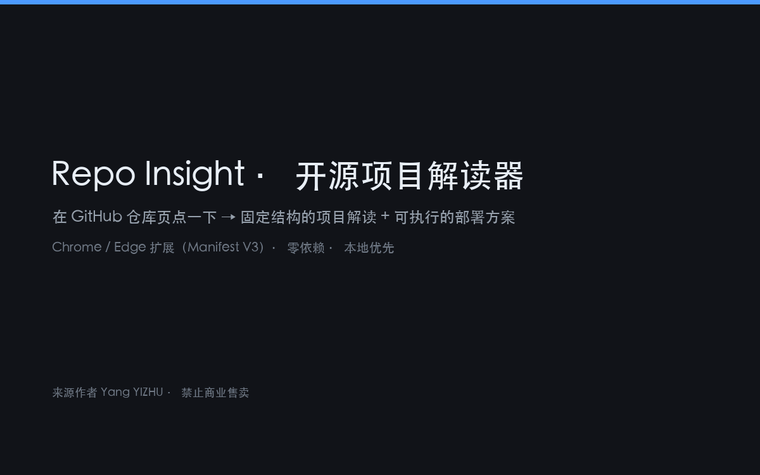
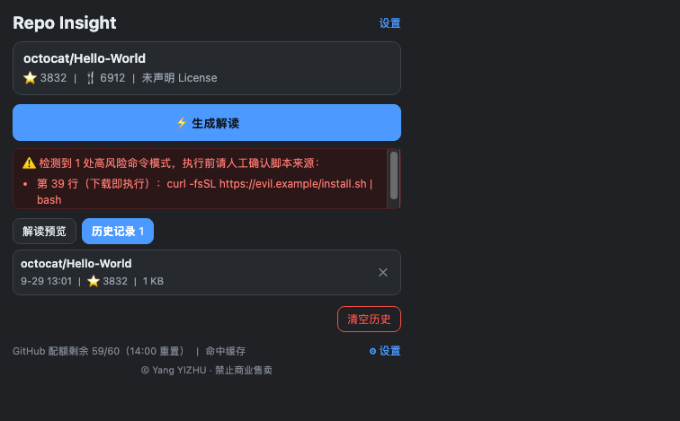
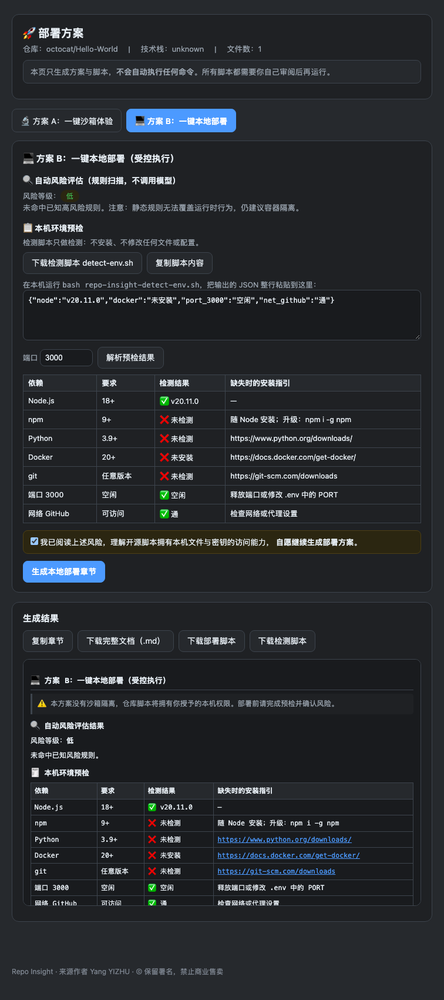

<div align="center">

# Repo Insight · 开源项目解读器

**在 GitHub 仓库页点一下，得到一份结构化「项目解读 + 部署方案」Markdown 文档**

Chrome / Edge 扩展（Manifest V3）· 零第三方依赖 · 本地优先 · 深浅色自适应

[](LICENSE)
[](#)
[](#快速开始)
[](#文件结构)
[](#开发与验证)
[](NOTICE.md)

[功能特性](#功能特性) · [快速开始](#快速开始) · [与同类工具的差异](#与同类工具的差异) · [安全与隐私](#安全与隐私) · [文件结构](#文件结构) · [English](README.en.md)

</div>


**30 秒演示**（真实 GitHub 页面 → 流式生成 → 部署方案三选一）：



---

## 这个工具解决什么问题

看到一个开源项目，想知道它到底做什么、值不值得研究、怎么跑起来，通常要花十几分钟翻 README、找依赖、猜部署方式，还容易踩坑。

Repo Insight 把这个过程压成一次点击：识别当前仓库 → 抓取元信息与 README → 生成一份**固定结构**的中文解读文档（定位 / 架构 / 风险 / 适合人群 / 部署工作流 / 评级）→ 需要部署时再给「沙箱体验」或「本地部署」两套方案，并附风险评估与可运行的脚本。

输出的 Markdown 可以直接复制、下载、投喂给 Codex / Cursor 之类工具当项目背景。

## 功能特性

### 一句话生成结构化解读

- 自动识别当前标签页的 GitHub 仓库（`owner/repo`），非仓库页直接拦下；
- 一次抓取仓库元信息、README、语言占比、根目录文件列表；
- 输出严格遵循固定模板，章节顺序固定、不增删：
  一句话定位 → 项目定位与核心功能 → 架构说明 → 短板坑点与风险（重点）→ 适合 / 不适合人群 → 一键部署工作流 → 总结（含评级）；
- 预览区按 Markdown 排版渲染，**复制与下载得到的仍是原始 Markdown**。

### 速度

- **流式输出**：模型边生成边显示，首批内容通常 1–3 秒出现，不必等整篇写完；
- **打开即预热**：弹窗打开时取一次仓库元信息（命中缓存则 0 次请求），立即显示 Star / 语言 / License 与配额；
- **ETag + 本地缓存**：仓库信息缓存 6 小时，304 响应不消耗 GitHub 配额；
- **输出详细度**：精简（约 2000 tokens，生成时间约减半）/ 标准（约 4000 tokens）。

### 部署方案二选一

生成解读后点「部署」进入部署页，二选一：

| 方案 | 内容 |
|---|---|
| 🔬 **A：一键沙箱体验**（推荐） | 按仓库特征识别载体并给出直达链接：GitHub Codespaces、Gitpod、StackBlitz；嵌入式 / 固件项目会明确提示不支持浏览器沙箱 |
| 💻 **B：一键本地部署**（受控执行） | 规则风险评估 → 只读环境预检脚本 → 强制勾选确认 → 生成部署章节与可运行脚本 |

生成的脚本默认 **Docker 容器隔离**，支持 `--dry-run`（只打印命令）、`--host`（宿主机运行，需二次确认）、`--clean`（删除容器、数据卷与克隆目录）。

> **能力边界（如实说明）**：Chrome 扩展无法执行系统命令，所以"一键"指**一键生成可运行的脚本**，不是替你执行。部署页不会自动运行任何命令。

### 风险与合规防护

- **规则风险评估**（不调用模型）：管道执行 shell、读取凭据文件、改 PATH / 启动项、提权与危险删除、关闭证书校验、编码载荷执行、全局静默安装依赖；
- **密钥扫描**：识别 README 中硬编码的 OpenAI / GitHub / AWS / Telegram / Slack / 私钥，命中即计为高风险；
- **疑似提交真实 `.env`** 单独告警；
- **许可证提示**：无 License / GPL / AGPL / MPL 逐级给出使用限制提示；
- **私有仓库守卫**：识别到私有仓库先询问，确认后才发送内容；选本地 Ollama 则完全不出本机；
- **提示词防注入**：README 以不可信数据边界传参，模型被明确禁止执行其中的指令；输出中的"下载即执行"等模式会被高亮。

### 安全与隐私

- **零服务端**：没有自建服务器，不做任何统计上报，不含第三方分析 SDK；
- **密钥掩码**：设置页只回显 `sk-abc****wxyz`，输入框留空表示不修改，另有「清除」按钮；
- **全链路脱敏**：预览、复制、下载、历史入库、导出备份、错误信息都会先打码密钥；
- **存储隔离**：`chrome.storage.local` 限制为仅扩展页面可读；
- **权限最小化**：`storage` + `activeTab`，加访问 GitHub 与所选模型服务的域名权限；
- **历史记录可控**：可关闭、可只清历史、可导出备份（不含密钥）、可一键清除全部数据。

### 其他

- 模型服务可选：DeepSeek / OpenAI / 智谱 / Moonshot / 通义 / **本地 Ollama** / 任意 OpenAI 兼容网关（自定义域名运行时申请权限）；
- 打开仓库页自动弹出弹窗（同一标签页同一地址只弹一次，可在设置页关闭）；
- 生成历史本地归档（最多 20 条，同仓库保留最新），点条目即可恢复全文；
- 界面跟随系统深浅色，配色与原生控件统一；
- 生成文档自带 AI 标识、许可证提示与溯源注释。

## 快速开始

### 环境要求

| 项目 | 要求 |
|---|---|
| 浏览器 | Chrome 110+ / Edge 110+ 或其它 Chromium 内核浏览器 |
| 操作系统 | macOS / Windows / Linux |
| 依赖 | 无（不需要 Node、不需要构建、不需要安装任何包） |
| 网络 | 需要访问 `api.github.com` 与你选择的模型服务 |

### 安装（开发者模式）

1. 下载仓库（`git clone` 或下载 ZIP 后解压）到**固定目录**，不要放在会被清理的下载目录；
2. 打开 `chrome://extensions`（Edge 为 `edge://extensions`）；
3. 打开右上角**开发者模式**；
4. 点击左上角**加载已解压的扩展程序**，选中包含 `manifest.json` 的那一层目录；
5. 点地址栏右侧拼图图标 🧩，把 **Repo Insight** 固定到工具栏。


> 加载时 Chrome 会提示「无法验证此扩展程序的来源」，这是所有开发者模式扩展的固有提示，不是本插件的问题。扩展只申请了 `storage`、`activeTab` 与访问 GitHub / 模型服务所需的域名权限。

### 配置（可选）

未配置模型时使用本地规则模板生成基础解读（含仓库信息、技术栈探测、部署骨架），功能不中断。

配置方式三选一：

| 方式 | 步骤 | 数据流向 |
|---|---|---|
| 云端模型（推荐 DeepSeek） | 设置页选提供商 → 填 API Key → 点「测试连接」 | 仓库元信息 + README 发送给所选服务商 |
| 本地 Ollama | 本机运行 `ollama serve` → `ollama pull qwen2.5:7b` → 设置页选 Ollama | **不出本机** |
| 不配置 | 什么都不填 | 只请求 GitHub API |

**GitHub Token（可选）**：仅为了提升配额（匿名 60 次/小时 → 5000 次/小时）时，**不需要任何写权限**。推荐用 Fine-grained token，Repository access 选 *Public Repositories (read-only)*；不要用 `repo` 或 `public_repo`。

## 使用

1. 打开任意 GitHub 仓库页，例如 `https://github.com/paperclipai/paperclip`；
2. 点击工具栏上的扩展图标（或在仓库页自动弹出）；
3. 点「⚡ 生成解读」，几秒内开始流式输出；
4. 用「📋 复制」或「💾 下载」取出 Markdown；
5. 需要部署时点「🚀 部署」，在部署页完成风险评估与环境预检；
6. 想回看历史，切到弹窗顶部的「历史记录」标签。



## 输出结构

生成的文档结构固定（`#` 为标题层级），可对照 [输出模板](docs/输出模板.md)：

```
> 🤖 本文档由 AI 生成（…），可能存在错误或过时信息…

# {仓库名} 项目深度解读
> 仓库地址 / ⭐ Star / 🍴 Fork / 主要语言 / License / 最近更新 / 一句话定位

## ✅ 项目定位 & 核心功能
## 🧩 架构说明
## ⚠️ 短板、坑点与风险（重点）
## 📌 适合 / 不适合人群
## 📝 一键部署工作流
### 环境依赖 / 部署步骤 / 验证部署是否成功 / 常见部署踩坑
## 📌 总结（含评级：实验原型 / 可用 / 生产级）

<!-- generated-by: repo-insight | author: Yang YIZHU | license: 禁止商业售卖 -->
```

模型输出若缺章节或顺序不符，预览区顶部会提示「未完全匹配模板」，可重新生成。

## 部署页



部署页的两套方案、风险评估规则、环境预检脚本与部署脚本的安全设计，详见 [部署方案说明](docs/部署方案.md)。

## 与同类工具的差异

对比常见的 GitHub AI 解读工具（ChatGPT / Claude 网页问答、GitHub Copilot Chat、各类"仓库总结"扩展与 AI 阅读器）：

| 维度 | 常见做法 | Repo Insight |
|---|---|---|
| 输出结构 | 自由发挥，格式每次不同 | **固定模板 + 结构自检**，缺章节会提示 |
| 部署方案 | 通常只做文字说明 | **沙箱链接 + 本地部署脚本（默认容器隔离）** 二选一，脚本可直接运行 |
| 风险评估 | 基本没有 | **纯规则扫描**：管道执行 shell、凭据读取、危险删除、硬编码密钥、可疑 `.env`… |
| 环境预检 | 无法检测，只能让用户自己看 | 生成**只读检测脚本**，粘贴 JSON 即出依赖表格 |
| 隐私控制 | 内容一律上云 | 私有仓库守卫 + **本地 Ollama 完全不出网** + 全链路密钥脱敏 |
| 数据留存 | 不明 | 历史可关 / 可删 / 可导出（不含密钥），一键清空 |
| 配额友好 | 每次重新抓取 | ETag + 6 小时缓存，重复查看同一仓库 **0 请求** |
| 依赖与体积 | 常需构建、依赖多 | **零依赖、无需构建**，克隆即可加载 |
| 权限 | 常见请求 `tabs` / `<all_urls>` | `storage` + `activeTab` + 白名单域名，自定义网关走运行时授权 |

更详细的逐项对比与各自适用场景见 [竞品对比](docs/竞品对比.md)。

## 文件结构

```
.
├── manifest.json          # 扩展清单（MV3）
├── background.js          # Service Worker：消息路由、抓取编排、自动弹出
├── popup.html / popup.js  # 弹窗：识别仓库、生成、预览、复制下载、历史
├── options.html / options.js  # 设置页：模型、Token、隐私与数据
├── deploy.html / deploy.js    # 部署页：沙箱方案 / 本地部署方案
├── privacy.html           # 隐私政策（扩展内可打开）
├── theme.css              # 深浅色主题变量（三个界面共用）
├── styles.css             # 弹窗布局与组件样式
├── lib/                   # 核心模块（无依赖，纯 ES Module）
│   ├── url.js             #  GitHub 仓库 URL 解析（保留字白名单）
│   ├── github.js          #  GitHub API：限流分流、超时、ETag 缓存
│   ├── llm.js             #  OpenAI 兼容调用：非流式 + 流式（SSE）
│   ├── prompt.js          #  系统提示词（含防注入条款）与用户内容组装
│   ├── template.js        #  输出模板、降级模板、结构自检、许可证分级
│   ├── risk.js            #  风险评估规则、沙箱载体识别、隔离建议
│   ├── deploy.js          #  部署脚本 / 只读检测脚本 / 部署章节生成
│   ├── security.js        #  密钥掩码、脱敏、命令风险扫描、文件名清洗
│   ├── history.js         #  历史记录存储与导出
│   ├── markdown-view.js   #  轻量 Markdown 渲染器（不使用 innerHTML）
│   ├── settings.js        #  设置读写、存储加固、数据清除
│   └── errors.js          #  错误码与用户可读提示
├── _locales/              #  zh_CN / en 国际化文案
├── icons/                 #  16 / 48 / 128 图标
├── docs/                  #  文档与截图
├── tools/                 #  图标生成、打包脚本（不随扩展分发）
├── LICENSE                #  署名 + 禁止商业售卖
└── NOTICE.md              #  署名与来源声明（不得移除）
```

完整逐文件说明见 [文件结构说明](docs/文件结构.md)。

## 开发与验证

本项目**没有构建步骤**：直接修改源码，在 `chrome://extensions` 点刷新即可生效。

打包与校验：

```bash
bash tools/package.sh            # 产出 zip，并自检"页面/模块引用的文件是否都在包里"
python3 tools/gen_icons.py       # 重新生成图标
```

验证方式（见 [开发与验证](docs/开发与验证.md)）：

- **静态与单元检查** 400+ 项：清单完整性、图标尺寸、DOM id 对应、无内联脚本、无 `eval` / `innerHTML`、URL 解析、许可证分级、脱敏、部署脚本生成；
- **编排层用例** 100+ 项：用假 `chrome` + 假 `fetch` 跑真实 `background.js`，覆盖缓存、私有仓库拦截、限流分流、历史生命周期、自动弹出；
- **真实浏览器验证** 90+ 项：在真实 Chrome 中加载扩展、跑通生成与部署页流程、比对深浅色配色；
- **生成的 shell 脚本**都会过 `bash -n` 语法校验，只读检测脚本会被实际执行并检查输出 JSON。

## 路线图

| 版本 | 内容 | 状态 |
|---|---|---|
| v0.1–0.2 | 单仓库解读、部署工作流、设置页、输出模板对齐 | ✅ |
| v0.3 | 历史记录、数据管理（统计 / 导出 / 清理） | ✅ |
| v0.4 | 流式输出、自动弹出、输出详细度 | ✅ |
| v0.5 | 部署方案二选一、风险评估、密钥脱敏、主题跟随系统 | ✅ |
| v0.6 | 多仓库横向对比（复用历史解读 + 配额预估） | 🚧 规划 |
| v0.7 | 对比任务持久化、备份导入 | 📋 规划 |
| v1.0 | 上架 Chrome Web Store、支持 GitLab / Gitee | 📋 规划 |

## 常见问题

**Q：提示「GitHub API 速率限制」？**
匿名配额为 60 次/小时，弹窗会显示剩余量与重置时间。配置 GitHub Token（无需写权限）可提升到 5000 次/小时；重复查看同一仓库有 6 小时缓存，不消耗配额。

**Q：模型报 401 / 429？**
401 是 Key 无效或过期，429 是服务商限流。两者都会自动降级为本地模板，不会中断流程。

**Q：为什么不用担心 API Key 泄漏？**
Key 只存本机 `chrome.storage.local`，界面只回显掩码，日志与错误信息都会脱敏，导出备份不含密钥。但请注意：`chrome.storage.local` 是明文存储，建议使用**受限权限**的 Key。

**Q：私有仓库会被发到模型服务商吗？**
默认不会——识别为私有仓库时会先询问，确认后才发送；选 Ollama 则完全不出本机；私有仓库的解读也默认不写入本地历史。

**Q：生成的部署脚本会自己跑吗？**
不会。扩展无法执行系统命令，脚本需要你审阅后手动运行；默认在 Docker 容器里跑，可先 `--dry-run` 预览命令。

## 许可与署名

**本项目来自于 Yang YIZHU，禁止商业售卖。**

- 允许：个人学习、研究、教学与非营利用途；允许修改与非商业分享；
- 要求：**必须完整保留**作者署名、"禁止商业售卖"标识、`LICENSE` 与 `NOTICE.md`；
- 禁止：任何形式的收费销售、付费代部署、捆绑销售、付费上架；禁止移除或篡改署名、冒充原创；
- 商业使用需事先取得作者书面授权。

完整条款见 [LICENSE](LICENSE) 与 [NOTICE.md](NOTICE.md)。

> 说明：该许可为「保留署名 + 禁止商业售卖」的自定义许可，**不是 OSI 认证的开源许可**，GitHub 会显示为 _Unknown license_。如果你需要被严格定义为开源，可改用 MIT / Apache-2.0，但那样无法禁止商业使用。

## 免责声明

解读文档由大模型生成，可能存在错误或过时信息；风险评估为静态规则扫描，**无法覆盖运行时的动态行为**；许可证提示不构成法律意见。执行任何部署命令前，请核对仓库官方 README 并自行承担风险。

---

<div align="center">

**来源作者：Yang YIZHU · 禁止商业售卖**

如果这个工具对你有帮助，欢迎 Star ⭐ —— 也欢迎提 Issue 告诉我你希望它支持什么。

</div>
