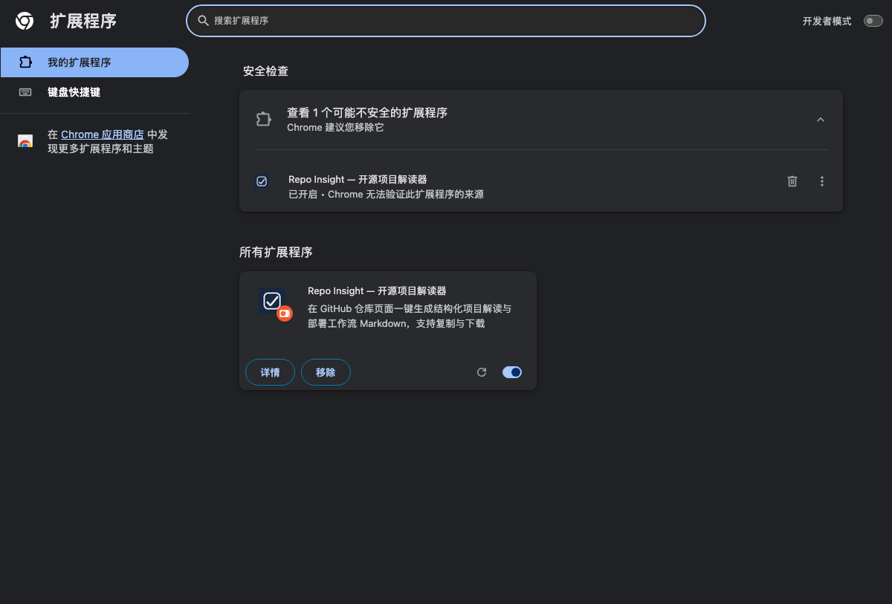

# 安装与使用

## 一、安装前准备

```bash
git clone https://github.com/repo-lens/repo-insight.git
# 或下载 ZIP 解压到固定目录，例如 ~/Extensions/repo-insight
```

解压后**顶层**应直接看到：

```
manifest.json  background.js  popup.html  popup.js  options.html  options.js
deploy.html  deploy.js  privacy.html  theme.css  styles.css
lib/  _locales/  icons/  docs/  tools/  README.md  LICENSE  NOTICE.md
```

> ⚠️ 最常见的失败原因：解压工具多套了一层目录，`manifest.json` 不在所选目录顶层，Chrome 会报「清单文件缺失或不可读取」。

## 二、加载扩展

1. 打开 `chrome://extensions`（Edge：`edge://extensions`）；
2. 打开右上角**开发者模式**；
3. 点左上角**加载已解压的扩展程序**，选中包含 `manifest.json` 的那一层目录；
4. 点地址栏右侧拼图图标，把 **Repo Insight** 固定到工具栏。



Chrome 会提示「无法验证此扩展程序的来源」——这是所有开发者模式扩展的固有提示。本扩展申请的权限只有：

| 权限 | 用途 |
|---|---|
| `storage` | 在本机保存设置与仓库缓存 |
| `activeTab` | 读取当前标签页地址，判断是否仓库页 |
| `https://api.github.com/*` | 拉取仓库元信息与 README |
| `https://github.com/*` | 判断是否仓库页（自动弹出用） |
| 各模型服务域名 | 调用所选模型 |
| 可选：任意 https 域名 | 仅当选择「自定义 Base URL」时按需申请 |
| `http://localhost/*`、`http://127.0.0.1/*` | 连接本机 Ollama |

## 三、上手三步

1. 打开任意仓库页，例如 `https://github.com/octocat/Hello-World`；
2. 点扩展图标 → 点「⚡ 生成解读」；
3. 用「📋 复制」或「💾 下载」取出 Markdown。

未配置模型时会走本地模板，几秒内出结果，功能不中断。

## 四、配置模型（可选）

### 方式 A：云端模型（以 DeepSeek 为例）

1. 设置页 → 提供商选 **DeepSeek**；
2. 填 API Key（`sk-` 开头）；
3. 点「测试连接」，显示「✔ 连接成功」即完成。

数据流向：点生成时，仓库元信息与 README（最多 30000 字符）会发送给该服务商。

### 方式 B：本地 Ollama（内容不出本机）

```bash
ollama serve              # 或直接启动 Ollama 应用
ollama pull qwen2.5:7b    # 拉一个模型
```

设置页选 **Ollama**，点「测试连接」。选择 Ollama 时不会申请任何云端模型域名，内容是本地循环。

### 方式 C：自定义网关

设置页选 **自定义**，填写 Base URL（必须 https，本机地址可用 http），点保存时会弹出该域名的访问授权。

## 五、GitHub Token（可选）

未认证时 GitHub API 限 60 次/小时（一次生成消耗 4 次，命中缓存为 0）。配置 Token 后提升到 5000 次/小时。

**只为提配额时，Token 不需要任何写权限**：

- 推荐 Fine-grained token，Repository access 选 *Public Repositories (read-only)*；
- 不要用 `repo`（全量私有仓库读写）或 `public_repo`（公开仓库读写）；
- 创建入口：`https://github.com/settings/tokens`。

## 六、常用设置

| 设置 | 说明 |
|---|---|
| 输出详细度 | 精简（约 2000 tokens，更快）/ 标准（约 4000 tokens） |
| 打开仓库页自动弹出 | 默认开启，同一标签页同一地址只弹一次 |
| 允许私有仓库发送到云端 | 默认关闭，关闭时遇到私有仓库会逐次询问 |
| 保存生成历史 | 默认开启，最多 20 条，同仓库保留最新 |
| 历史包含私有仓库内容 | 默认关闭 |
| 附加独立许可证章节 | 默认关闭（许可证限制并入风险章节，保持模板结构） |

## 七、自检清单（约 2 分钟）

| # | 操作 | 预期 |
|---|---|---|
| 1 | 打开仓库页点图标 | 显示 `owner/repo`，按钮可用 |
| 2 | 点「生成解读」 | 数秒内开始出现内容；底部显示 GitHub 配额 |
| 3 | 点「复制」 | 粘贴内容与预览一致 |
| 4 | 点「下载 .md」 | 得到 `{repo}-解读.md` |
| 5 | 打开 GitHub 首页再点图标 | 提示「未识别到仓库」，按钮禁用 |
| 6 | 切到「历史记录」标签 | 能看到刚生成的仓库，点击可恢复全文 |
| 7 | 点「🚀 部署」 | 新标签页打开部署页，显示风险等级与沙箱链接 |
| 8 | 切换系统深色/浅色 | 三个界面都跟着变，不应出现白底页面 |
| 9 | `chrome://extensions` → Service Worker | 控制台无红色报错 |

## 八、常见问题

| 现象 | 原因 | 处理 |
|---|---|---|
| 「清单文件缺失或不可读取」 | 选错目录层级 | 选中**直接包含 manifest.json** 的目录 |
| 「Default locale was specified, but _locales subtree is missing.」 | 目录缺 `_locales/` | 重新完整解压，不要单独删 `_locales` 或 `lib` |
| 提示「GitHub API 速率限制」 | 匿名配额用尽 | 等重置（弹窗会显示时间）或配置 Token |
| 模型 401 | Key 无效 / 过期 | 设置页重新填入 |
| 模型 429 | 服务商限流 | 稍后重试或换模型 |
| 提示「尚未授予该域名的访问权限」 | 自定义提供商未授权 | 设置页点一次「保存」，在弹窗中允许 |
| 一直转圈不结束 | 后台 Service Worker 被回收 | 重新生成；反复出现请附控制台报错提 Issue |
| 弹窗四角露白 | 浏览器弹窗窗口底色（少见） | 提 Issue 并附浏览器与版本 |

## 九、更新与卸载

**更新**：覆盖目录内容 → `chrome://extensions` 点卡片上的刷新按钮 → 若清单权限有变，Chrome 会要求重新确认。

**卸载**：`chrome://extensions` → 移除。卸载时 Chrome 会自动删除扩展专属存储（含 Key 与历史）；想要保险可在卸载前先「导出历史备份」再「清除所有本地数据」。
